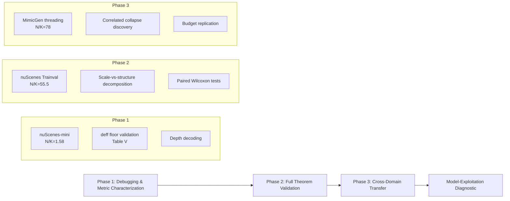

# Dynamic LeJEPA


### Dynamic LeJEPA: Maximum Entropy Representations for Sequential Prediction and Latent Planning

<p align="center">
<a href="https://www.alphaxiv.org/pdf/2609.dynamic-lejepa-physics-informed-world-models">📄 Paper</a> •
<a href="https://huggingface.co/spaces/MohsenAI5/Dynamic-LeJEPA">🌐 Demo</a> •
<a href="https://github.com/Dynamic-LeJEPA/Dynamic-LeJEPA">🧪 Code</a>
</p>

<p align="center">
<a href="https://opensource.org/licenses/MIT">

</a><br>
<br>
<br>
<a href="https://arxiv.org/abs/">

</a>
</p>

License: MITPython 3.9+CI

#### The design rule: Encoder maximum entropy · Predictor dynamics · Decoder physics — never the encoder.

### 📖 Overview

This repository contains the official implementation of Dynamic LeJEPA, a theoretically grounded framework for Joint-Embedding Predictive Architectures (JEPAs) in sequential domains like autonomous driving and robotic manipulation. The work resolves a critical paradox: while injecting domain knowledge (physics, kinematics, geometry) into JEPAs consistently degrades performance, we prove through six theorems that the isotropic maximum-entropy embedding is symmetry-stable under sequential prediction losses, and that physics constraints are provably benign on the observation decoder but destructive on the encoder.

🧩 Key Features

Theoretical Guarantees: Six theorems proving that:
Prediction losses do not alter the optimal maximum-entropy embedding distribution (Theorem IV.1)
Physics constraints belong in the decoder, not the encoder (Theorem IV.10/Corollary IV.11)
Sample complexity requirements for reliable distributional validation (Proposition VI.1)
Validated Design Principle: Encoder maximum-entropy · Predictor dynamics · Decoder physics
Cross-Domain Validation: Validated on both autonomous driving (nuScenes) and robotic manipulation (MimicGen)
Robust Experimental Protocol: 110 seeded runs across 2 domains and 2 encoder mechanisms with paired Wilcoxon significance (Holm-corrected p=0.0078)
🛠️ Installation
Prerequisites
Python 3.8+
PyTorch 2.0+
CUDA (recommended)

Setup

Clone the repositorygit clone https://github.com/Dynamic-LeJEPA/Dynamic-LeJEPA.gitcd Dynamic-LeJEPA# Install dependenciespip install -e .[dev] - Run tests to verify installationpytest -q
Data Setup

-For dataset preparation and download instructions, refer to docs/DATA.md. The primary datasets are:

nuScenes (autonomous driving)

MimicGen (bimanual robotic manipulation)

🚀 Quick Start

Phase 1: Debugging & Metric Characterization

```python
# Control experiment on nuScenes-mini
python experiments/phase1_nuscenes_mini/run_control_experiment.py
```
Phase 2: Full Theorem Validation (nuScenes Trainval)

```python
    python experiments/phase2_nuscenes_trainval/run_ablation.py \
    --data-root /path/to/v1.0-trainval01_blobs \
    --meta-root /path/to/v1.0-trainval
```

Phase 3: Cross-Domain Transfer (MimicGen)

```python
# Primary ablation (15 epochs)
python experiments/phase3_mimicgen/run_ablation.py \
--hdf5 /path/to/two_arm_threading.hdf5 --epochs 15 --out results/phase3

# Budget replication (30 epochs)
python experiments/phase3_mimicgen/run_ablation.py \
--hdf5 /path/to/two_arm_threading.hdf5 --epochs 30 --out results/phase3_budget

# Latent CEM planning + model-exploitation diagnostic
python experiments/phase3_mimicgen/run_cem_planning.py \
--hdf5 /path/to/two_arm_threading.hdf5 --ckpt-dir checkpoints/phase3
```

🧪 Experimental Protocol

The paper employs a three-phase experimental design:



### 📈 Key Results

Phase 2 Results (nuScenes Trainval, N/K = 55.5)

     | Metric     | no physics    | decoder physics  | encoder physics |
     |------------|---------------|------------------|-----------------|
     | d_eff      | 0.9858 ± .004 |  0.9678 ± .005   | 0.9394 ± .008   |
     | H-ratio    |   0.9637      |     0.8165       |   0.822         |
     | scale ratio| 0.9086        |       0.6045     |   0.6241        |


Scale-vs-structure decomposition: Both physics conditions lose ~equal scale, but the encoder condition's Δ_structure = 0.028 (2.6× the decoder gap) — the genuine, non-proportional eigen-spectrum distortion predicted by Corollary IV.11.

Phase 3 Results (MimicGen, N/K = 78)

    | Metric            | no physics    | decoder physics | encoder physics |
    |-------------------|---------------|---------------|-------------------|
    | d_eff             | 0.1846 ± .004 | 0.1740 ± .003 | 0.1380 ± .004     |
    | prediction R²     | 0.784         | 0.864 | 0.966 |
    | probe R² (proprio)| 0.937         | 0.961 | 0.984 |              


The two-sided signature of Corollary IV.11: Encoder physics simultaneously destroys entropy and inflates predictability — the encoder is dragged toward the ≤14-D image of the action space. Budget replication (30 ep): encoder gap grows 0.047 → 0.070 (+49%) while all scale/H-ratio effects vanish — the violation is budget-monotone and purely structural.

Phase 1 Results (nuScenes-mini, N/K = 1.58)
At N/K = 1.58, d_eff ≈ 0.004 for both the model and a true N(0, I₂₅₆) control (Table IV) — low d_eff in low-data regimes reflects sample starvation, not embedding collapse. This motivates the N/K ≥ 5 reliability threshold.

### ⚠️ Important Usage Notes

1- Two d_eff Estimators: The repository implements both covariance-based and diagonal estimators. The covariance estimator (compute_effective_dim_from_embeddings) is used for all final ablation comparisons and is subject to the N < K floor. The diagonal estimator (compute_effective_dim) is only for fast sample-complexity sweeps. Do not compare them numerically.

2- SIGReg+ Implementation: For low-dimensional data, use src/dlejepa/sigreg.py with SIGReg+ (covariance off-diagonal penalty) to restore joint structure (d_eff from 0.022 to 0.18) while preserving marginal entropy.

3- Posterior Signal Fraction: For variational encoders, monitor the posterior signal fraction Var_x[μ]/(Var_x[μ] + E_x[σ²]). A nominally satisfied marginal KL does not certify signal, because collapse can hide beneath the encoder's own sampling-noise floor.

### 📝 Licensing

Training, evaluation, and analysis code: MIT License
Manuscript text and figures: CC BY 4.0
Trained checkpoints and derived result files:
nuScenes: CC BY-NC-SA 4.0
MimicGen: License of upstream MimicGen release

### 🤝 Contributing

We welcome contributions! Please see CONTRIBUTING.md for guidelines.

### 📧 Contact

For questions and inquiries, please contact:

Mohsen Mostafa - mohsen.mostafa.ai@outlook.com

### 📚 Citation

If you use Dynamic LeJEPA in your research, please cite:

     @article{mostafa2025dynamic,
       title={Dynamic LeJEPA: Maximum Entropy Representations for Sequential Prediction and Latent Planning with Theoretical Guarantees},
       author={Mostafa, Mohsen},
       journal={arXiv preprint arXiv:2511.08544},
       year={2025}
     }

<div align="center">

⭐ Star this repository if you find it helpful!

← Back to Paper • Interactive Demo →

</div>
```

This README.md provides a comprehensive overview of the Dynamic LeJEPA repository, incorporating the latest theoretical developments, experimental results, and practical guidance from your updated paper. It maintains all the essential elements of a good README while highlighting the novel contributions and important usage notes for researchers who want to reproduce or build upon your work.
